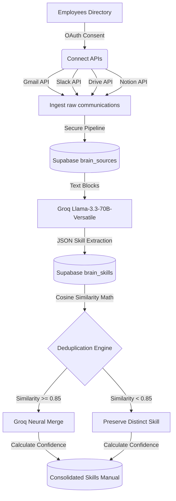

# Company Brain: Enterprise Knowledge Capture System

> **"Every company has critical know-how scattered everywhere. Some of it lives in people's heads. Some of it is buried in old email accounts, Slack threads, support tickets, and databases."** — *Tom Blomfield*

Company Brain is a production-grade enterprise knowledge capture system that ensures an employee’s institutional memory is protected when they leave or transfer. It systematically sweeps scattered digital footprints—Gmail threads, Slack conversations, Google Docs, and Notion blocks—extracts operational workflows using the high-performance Groq API, and deduplicates procedures using advanced mathematical text vector similarity matching. 

The resulting outputs are consolidated into a unified, high-confidence catalog of executable enterprise skills: the company's living operational manual.

---

## System Architecture



### 1. Sweep Phase (Multi-User Ingestion)
- **Gmail Sweeper:** Connects using Google OAuth. Search is focused on high-density business logic keywords: `"refund OR policy OR approval OR exception OR decision OR rule OR process OR escalat*"` (restricted to 50 threads per employee to respect rate limit standards).
- **Slack Sweeper:** Utilizes Slack OAuth. Harnesses the Slack `search.messages` API or public channel history logs to capture procedural posts, threaded responses, and pinned messages matching the search keywords.
- **Drive Sweeper:** Pulls document logs, scans for Google Docs, extracts body texts, and stores them under the employee's ID.
- **Notion Sweeper:** Searches Notion workspaces for relevant pages and scans individual database pages and block children to extract raw text.

### 2. Extract Phase (Groq Llama-3.3-70B)
Raw documents and message logs are piped to the **Groq API** running `llama-3.3-70b-versatile` with custom system rules and deterministic parameters. The LLM extracts discrete business procedures, generating a structured JSON schema for each skill:
- **Skill Name:** Standardized lowercase `snake_case` (e.g. `auto_approve_small_refunds`).
- **Trigger:** The exact operational trigger initiating the workflow.
- **Steps:** A chronological, self-contained list of executable instructions.

### 3. Deduplicate Phase (Vector Similarity Merge)
When identical business procedures are extracted from different communications (e.g., Slack thread, email reply, drive doc), the system applies Cosine Similarity math on token frequency n-grams:
- If **Cosine Similarity $\ge 0.85$**, they are flagged as duplicates.
- The duplicates are sent to **Groq** to merge nuances and generate a single optimal procedural card.
- **Confidence Scoring:** Calculated mathematically based on organic frequency:
  $$\text{Confidence Score} = \frac{\text{Unique Employees Mentioning Skill}}{\text{Total Sweep Connected Employees}}$$
- Contributor mapping profiles are compiled into a unified `source_employees: { employee_ids: [...], frequency: n }` ledger.

---

## Getting Started

### 1. Database Provisioning
This project connects to a **Supabase** cloud database. Provision the tables and indices by pasting the SQL from [supabase_schema.sql](file:///c:/Users/Umesh%20Shinde/Desktop/Company%20brain/supabase_schema.sql) directly into your Supabase SQL Editor.

### 2. Environment Configuration
Create a `.env.local` file in the root folder of your project and configure the following variables:

```env
# Supabase Cloud Keys (Secure Service-Role for Elevated Admin Capability)
NEXT_PUBLIC_SUPABASE_URL=your_supabase_url
SUPABASE_SERVICE_ROLE_KEY=your_supabase_service_role_key

# Groq High-Performance LLM Key
GROQ_API_KEY=your_groq_api_key

# Google OAuth Credentials (Gmail & Drive readonly scopes)
GOOGLE_CLIENT_ID=your_google_client_id
GOOGLE_CLIENT_SECRET=your_google_client_secret
GOOGLE_REDIRECT_URI=http://localhost:3000/api/auth/google/callback

# Slack OAuth Credentials (channels history & search scopes)
SLACK_CLIENT_ID=your_slack_client_id
SLACK_CLIENT_SECRET=your_slack_client_secret
SLACK_REDIRECT_URI=http://localhost:3000/api/auth/slack/callback

# Notion OAuth Credentials (workspace read scopes)
NOTION_CLIENT_ID=your_notion_client_id
NOTION_CLIENT_SECRET=your_notion_client_secret
NOTION_REDIRECT_URI=http://localhost:3000/api/auth/notion/callback

# Base Host
NEXT_PUBLIC_APP_URL=http://localhost:3000
```

### 3. Booting Local Environment
Install dependencies and boot up the Next.js App Router local development server:
```bash
npm install
npm run dev
```
Open `http://localhost:3000` in your web browser.

### 4. Running Integration Tests
Execute the independent integration suite to verify connectivity to Supabase, mock OAuth entries, compute local vector cosine similarity, and test Groq skill extraction:
```bash
node scripts/test_integrations.js
```

---

## API Documentation Catalog

| Method | Endpoint | Payload / Params | Description |
| :--- | :--- | :--- | :--- |
| **POST** | `/api/admin/employees` | `{ employee_id, name, email, department, role, org_id }` | Registers a new employee profile |
| **GET** | `/api/admin/employees` | `?org_id={orgId}` | Lists registered profiles with active connection status |
| **GET** | `/api/auth/google` | `?employee_id={empId}&org_id={orgId}` | Initiates Gmail & GDrive OAuth authorization redirect |
| **GET** | `/api/auth/slack` | `?employee_id={empId}&org_id={orgId}` | Initiates Slack Workspace OAuth authorization redirect |
| **GET** | `/api/auth/notion` | `?employee_id={empId}&org_id={orgId}` | Initiates Notion Workspace OAuth authorization redirect |
| **POST** | `/api/admin/sweep-org` | `{ org_id, employee_ids: [...] }` | Asynchronously triggers org knowledge ingestion |
| **GET** | `/api/admin/sweep-status/{orgId}` | *None* | Streams status, metrics, and live orchestrator terminal logs |
| **POST** | `/api/admin/deduplicate-skills` | `{ org_id }` | Runs vector cosine similarity and merges raw duplicates |
| **GET** | `/api/skills/{orgId}/deduped` | *None* | Retrieves unified skills catalog sorted by confidence |
| **POST** | `/api/skills/verify` | `{ skill_id, verified_by_human: true/false }` | Toggles human-verified "Company Approved" state |

---

## Security & Privacy Enforcement
1. **OAuth Encryption:** Third-party OAuth tokens and secrets are stored in restricted columns inside Supabase.
2. **Access Scoping:** Individual employees can only manage their own profile and view their own contributions.
3. **Admin Aggregation:** Administrators can trigger sweeps and view the final aggregated catalog of corporate skills, but cannot inspect or search raw employee communication bodies directly, protecting individual privacy.
4. **Audit Logging:** Every employee data access step is logged in the orchestrator status state.
